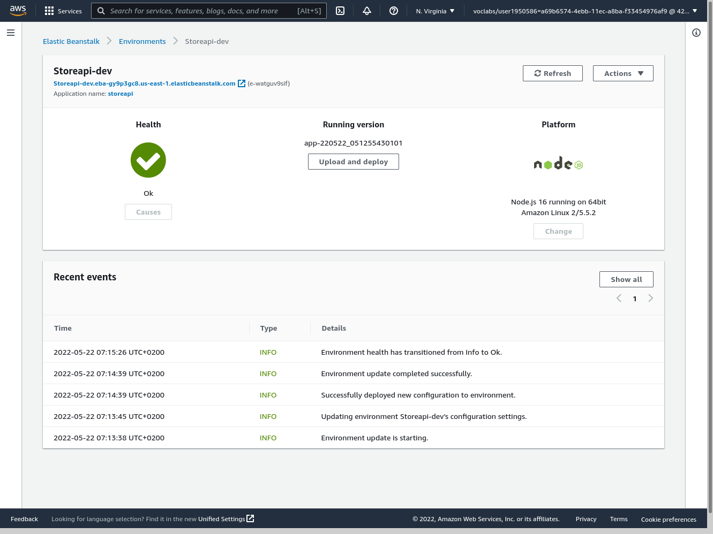
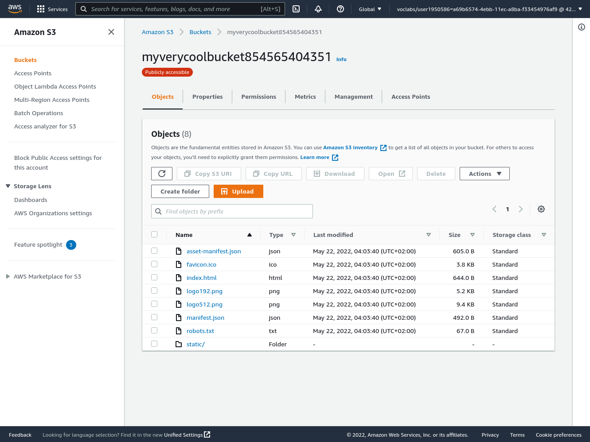

# Infastructure 

## 1.AWS :
this project uses AWS a cloud hosting provider.

### What is AWS ? :
Amazon Web Services (AWS) is the world’s most comprehensive and broadly adopted cloud platform, offering over 200 fully featured services from data centers globally. Millions of customers—including the fastest-growing startups, largest enterprises, and leading government agencies—are using AWS to lower costs, become more agile, and innovate faster.

## AWS Services used:

### AWS IAM :
AWS Identity and Access Management (IAM) provides fine-grained access control across all of AWS. With IAM, you can specify who can access which services and resources, and under which conditions. With IAM policies, you manage permissions to your workforce and systems to ensure least-privilege permissions.

you need to get credintaionals with the correct permisions for :
    * Adminstration of Elastic beanstalk.
    * Adminstration of S3 buckets.
    * Adminstration of RDS.

### AWS Elastic Beanstalk :
AWS Elastic Beanstalk is an easy-to-use service for deploying and scaling web applications and services developed with Java, .NET, PHP, Node.js, Python, Ruby, Go, and Docker on familiar servers such as Apache, Nginx, Passenger, and IIS.

You can simply upload your code and Elastic Beanstalk automatically handles the deployment, from capacity provisioning, load balancing, auto-scaling to application health monitoring. At the same time, you retain full control over the AWS resources powering your application and can access the underlying resources at any time.

- this project created enviroment named storeapi-dev with this settings :
    * platform : Node.js
    * Node.js version: 16
    * region : us-east-1
    * application : storeapi

### AWS Relational Database (RDB) :
Amazon Relational Database Service (RDS) is a collection of managed services that makes it simple to set up, operate, and scale databases in the cloud.

- this project created database with this settings:
    * database-engine : Postgresql database.
    * access : publicly from any where (edit the inbound rules).

### AWS S3 bucket:
Amazon Simple Storage Service (Amazon S3) is an object storage service offering industry-leading scalability, data availability, security, and performance.

- this project  create S3 bucket for static web hosting with this settings:

    * access publicly 
    as shown here in this image :
    

    * enabled for static web hosting 
    as shown in this image :
    

    and this is overview image for S3 bucket :
    

## 2.Circle CI:

we used Circle CI as platform for continuse integration

### Excutor :
we used Docker as excutor with this image "cimg/base:stable"

### orbs :
we used orbs (pre-configered files) to save time and avoid errors , we used these orbs :

1. node: circleci/node@5.0.2 for installing node js and yarn with version 16
2. aws-cli: circleci/aws-cli@3.1.1 for installing aws-cli and setup it with user credintials
3. eb: circleci/aws-elastic-beanstalk@2.0.1 for installing eb console line interface and setup it with credintales

