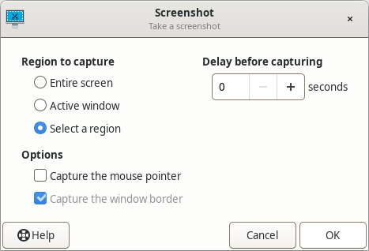
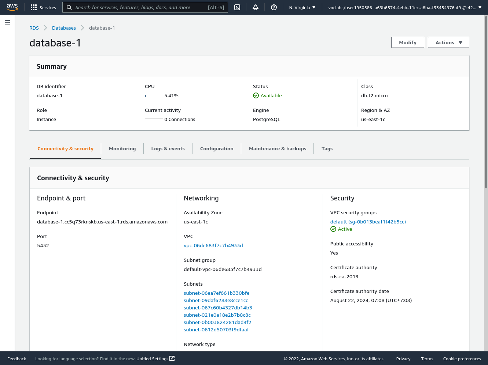
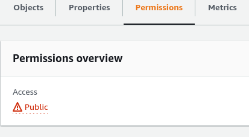
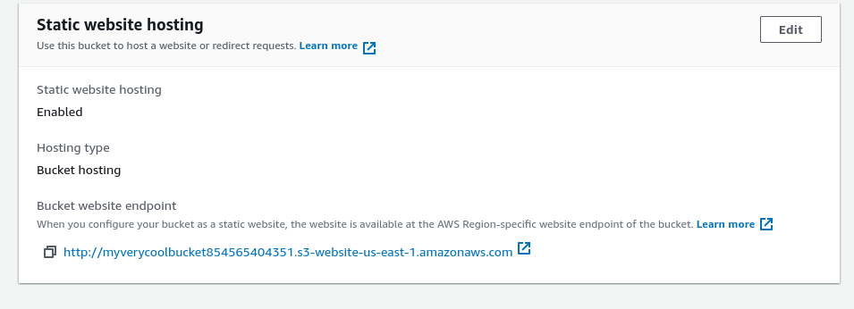
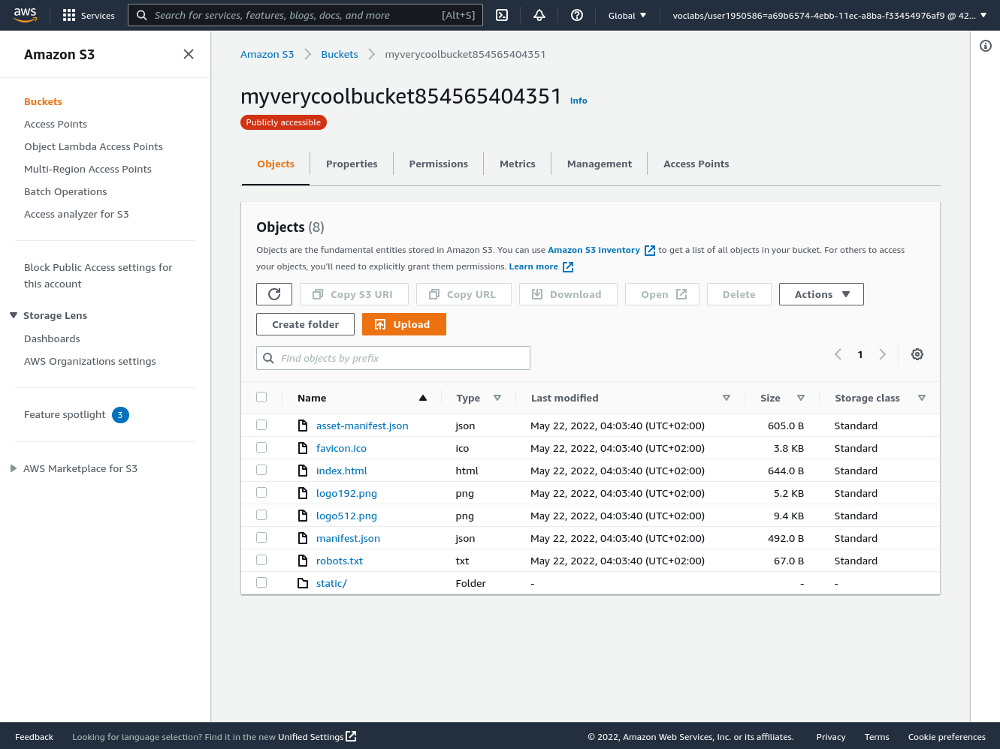

# INSTALLATION:

all installation process must be in this order to work


## Pre-Installation:
* make sure **Node.JS** is installed on your machine prefered Latest version Or LST version 
this app was tested on version 17.9.0 and 16.*.*

* make sure **Yarn** or **npm** is installed on your machine : 
this project uses **Yarn** but if want to use **npm** change scripts on package json on api.

* make sure you have **bash shell** and **zip** packages.

* finally make sure you are on the root folder for your application 

## Behined the scence :
this scripts runs tow sctipts :
- for store api : that change directory to storeapi/ sub folder and runs script to preform the intended changes on the backend .
- for store frontend : that change directory to storefrontend/ sub folder and runs script to preform the intended changes on the frontend .


## STEPS :
### Installation process :
it quite easy accually you just have to run on terminal:
```
    yarn install
```
Or 

```
npm install
```


### Build process :

use command : yarn build 

### Test :

use command : yarn test:api to test backend 
use command : yarn test:frontend to test frontend

### Deploy :

use command : yarn deploy 

## Enviourmental variables :


| Varable Name   |      description        | requried| should be|
|----------------|:-----------------------:|:----:|:----:|
| NODE_ENV  |  determine the state of the code test or dev | yes | dev|
| HOST |    Database host   |Database host   |yes   |-----   |
| DB_PORT| database port| yes | any number  |
| DATABASE| database name | yes | any string  |
| DATABASE_TEST| database test name | no | any string  |
| DB_USER| database user name | yes | any string  |
| PASSWORD| database user password | yes | any string  |
| PEPPER| for hasing password | yes | any string  |
| SALT_ROUNDs| for hasing password | yes | any number prefered > 9  |
| TOKEN_SECRET| for JWT authentication | yes | any string  |


## perpare AWS 

- this project uses AWS for deploying so you need to get credintaionals with the correct permisions for :
    * Adminstration of Elastic beanstalk.
    * Adminstration of S3 buckets.
    * Adminstration of RDS.

- this project assumes that you created enviroment named storeapi-dev with this settings :
    * platform : Node.js
    * region : us-east-1
    * application : storeapi

make sure that the enviroment up and running and it health is **OK** as in this image :


**NOTE** the last image accuatly taken after deploying.

- this project assumes that you created database with this settings:
    * database : Postgresql database.
    * access : publicly from any where (edit the inbound rules).
    * give it name : because AWS will not create database if you dont provide name.

it should be active and the url and port are accessable.

like this image :




- this project assumes that you create S3 bucket for static web hosting with this settings:

    * access publicly 
    as shown here in this image :
    

    * enabled for static web hosting 
    as shown in this image :
    

    and this is overview image for S3 bucket :
    
