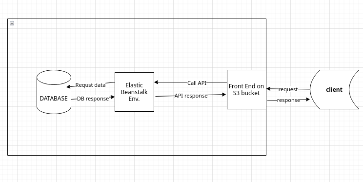

# OVERVIEW :
this project is a proff of concept for CI - CD where I used [Circle ci](www.circleci.com) for continouse integration **CI**.
And used AWS as Cloud Host provider to compelet the seconde phase continous deploment.

this project id a part of Udacity nanodgree and is required for graduation.

## GENERAL :

as shown on the past diagram the client can contact the frontend throw url that hosted on S3 bucket  which contact backend that hosted on elastic beanstalk enviroment.

the backend request from database if needed and get its response to be further processed and delver the final reponse to client through frontend
