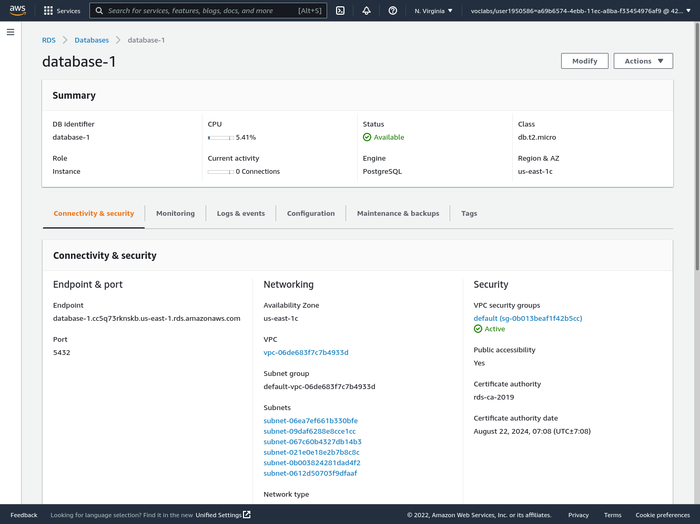

# PIPLINE :
## provider :
Circle ci 

## Pre-steps :

- this project uses enviromental variables so make sure to add these varablies on the Enviromintal Variables section under Settings of your project at Circle Ci

as displayed on this image :

- this project uses AWS for deploying so you need to get credintaionals with the correct permisions for :
    * Adminstration of Elastic beanstalk.
    * Adminstration of S3 buckets.
    * Adminstration of RDS.

- this project assumes that you created enviroment named storeapi-dev with this settings :
    * platform : Node.js
    * region : us-east-1
    * application : storeapi

make sure that the enviroment up and running and it health is **OK** as in this image :

**NOTE** the last image accuatly taken after deploying.

- this project assumes that you created database with this settings:
    * database : Postgresql database.
    * access : publicly from any where (edit the inbound rules).
    * give it name : because AWS will not create database if you dont provide name.

it should be active and the url and port are accessable.

like this image :

- this project assumes that you create S3 bucket for static web hosting with this settings:

    * access publicly 
    as shown here in this image :
    

    * enabled for static web hosting 
    as shown in this image :
    

    and this is overview image for S3 bucket :
    

### Enviourmental variables :

| Varable Name   |      description        | requried| should be|
|----------------|:-----------------------:|:----:|:----:|
| NODE_ENV  |  determine the state of the code test or dev | yes | dev|
| HOST |    Database host   |Database host   |yes   |-----   |
| DB_PORT| database port| yes | any number  |
| DATABASE| database name | yes | any string  |
| DATABASE_TEST| database test name | no | any string  |
| DB_USER| database user name | yes | any string  |
| PASSWORD| database user password | yes | any string  |
| PEPPER| for hasing password | yes | any string  |
| SALT_ROUNDs| for hasing password | yes | any number prefered > 9  |
| TOKEN_SECRET| for JWT authentication | yes | any string  |

## STEPS OF THIS PIPLINE :

### set up the excutor :
* this pipline uses Docker as its excuter , no need for spacfic image.
check /.circleci/config.yaml for more detalies.

* also to save time and aviod errors used pre config files (Orbs) for this three :
    - node js to install node and yarn
    - aws cli to install cli and setup aws 
    - elastic beanstalk to install eb and set up elastic beanstalk

### install dependencies :

using yarn install form package.json file at the root of the project.

that install all dependacies for both forntend and backend(API)

### Build the project :

using yarn build form package.json file at the root of the project.

that build for both forntend and backend(API)

## test frontend :

using yarn test:front 

## deploy project :

using yarn deploy form package.json file at the root of the project.

that deploy for both forntend and backend(API)

## The End :
you should get green build for every command on Circle ci as shown on this image :

and bagage on GitHub indecats that like this image :

